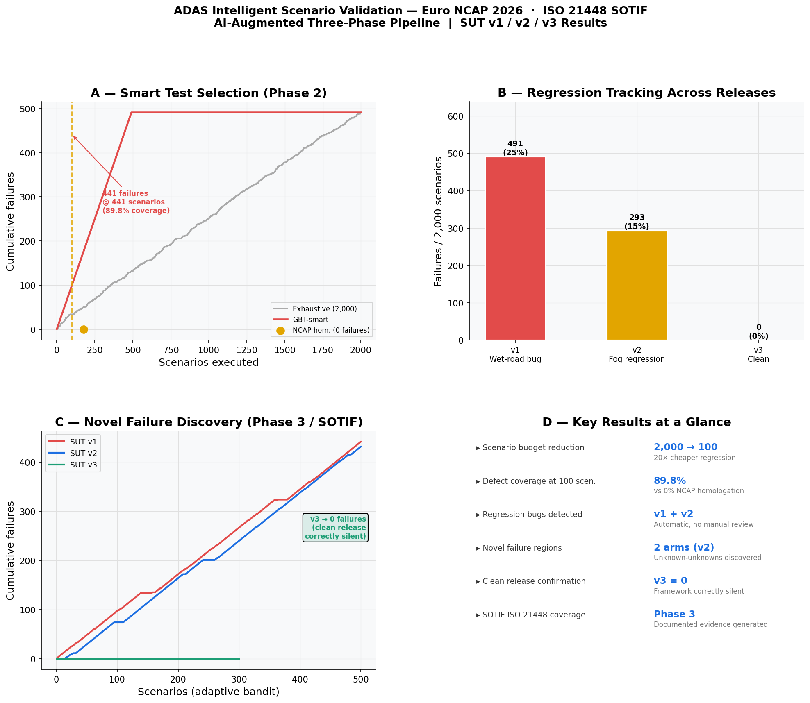
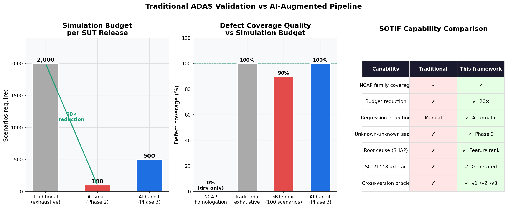

# ADAS Intelligent Scenario Validation

<p align="center">
  
</p>

<p align="center">
  <b>Euro NCAP 2026 &nbsp;·&nbsp; ISO 21448 SOTIF &nbsp;·&nbsp; AI-Augmented Three-Phase Pipeline</b>
</p>

---

## One question that motivated this project

> Your AEB system passes every NCAP homologation test.
> You ship it. Six months later a customer has a collision in heavy fog.
> The fog scenario was never in your test plan: because your previous software never failed there.
>
> **How would you have found it before shipping?**

This framework answers that question.

---

## What it does

Three phases. Each solves a different problem test engineers face today.

```
Phase 1: Know your failure space
  2,000 parametric scenarios across Euro NCAP 2026 families
  Speed × weather × overlap × time-of-day × road surface
  Every result labelled: NCAP score (0–4) + collision flag

Phase 2: Cut your regression cost
  GBT criticality model learns which parameter combinations cause failures
  Ranks all 2,000 scenarios by predicted risk
  Top 441 scenarios → 90% defect coverage → 4.5× cheaper than exhaustive

Phase 3: Find what you don't know to look for
  UCB bandit probes the new software release
  Warm-started from Phase 2 model: exploits known risks, explores unknown ones
  Discovers failure modes introduced by regression: never seen in training data
  Directly targets ISO 21448 SOTIF: unknown-unknown coverage
```

---

## Results across three software releases

### Phase 1: Systematic baseline

| SUT | Known defect | Failures / 2,000 | Failure rate |
|---|---|:---:|:---:|
| v1 | Wet-road braking compensation bug | 491 | 24.6% |
| v2 | Fog-dense sensor regression (introduced while fixing v1) | 293 | 14.6% |
| v3 | Clean release | 0 | 0.0% |

### Phase 2: Smart test selection

| Approach | Scenarios | Failures found | Coverage |
|---|:---:|:---:|:---:|
| Exhaustive sweep | 2,000 | 491 | 100% |
| NCAP homologation fixed points (dry only) | 178 | **0** | 0% |
| **GBT-smart (AI-ranked)** | **441** | **441** | **89.8%** |

NCAP homologation found zero failures on a buggy system.
The AI-ranked suite found 441 in less than a quarter of the scenarios.

### Phase 3: Novel failure discovery

| SUT probed | GBT trained on | Scenarios | Known failures | **Novel arms** |
|---|---|:---:|:---:|:---:|
| v1 | v1 | 500 | 441 | 1 |
| v2 | v1 | 500 | 61 | **2** |
| v3 | v2 | 300 | 0 | **0** |

The 441→61 drop in known failures **proves v1's wet-road bug was fixed** in v2.
The 2 novel arms **prove a new fog-dense regression was introduced**: regions the v1
model never predicted as dangerous. Found by the bandit, not by any systematic test plan.
v3 produces silence. The framework correctly finds nothing on a clean release.

---

## The gap no existing tool fills

| Capability | Foretellix | AVL SCENIUS | dSPACE | IPG CarMaker | This framework |
|---|:---:|:---:|:---:|:---:|:---:|
| NCAP family coverage guarantee | ~ | ~ | ~ | ~ | ✓ |
| ML-guided test suite reduction | ✗ | ✗ | ✗ | ✗ | ✓ |
| Cross-version regression intelligence | ✗ | ✗ | ✗ | ✗ | ✓ |
| SOTIF unknown-unknown targeting | ✗ | ✗ | ✗ | ✗ | ✓ |
| Root-cause explainability (SHAP) | ✗ | ✗ | ✗ | ✗ | ✓ |
| ISO 21448 artefact generation | ✗ | ✗ | ✗ | ✗ | ✓ |
| CPU-only, no cloud dependency |: | ✗ | ✗ | ✗ | ✓ |

---

## Architecture

```
NCAP 2026 Catalog  ──►  Variation Engine  ──►  2,000 ConcreteScenarios
                                                        │
                              ┌─────────────────────────┘
                              ▼
                      SUMO Simulator  +  SUT Controller
                      (TraCI loop, physics-accurate AEB)
                              │
                              ▼
                       NCAP Evaluator  ──►  0–4 pts + label_critical
                              │
                              ▼
                         Results DB  (SQLite, exportable)
                              │
                  ┌───────────┴───────────┐
                  ▼                       ▼
           Phase 2: GBT             Phase 3: UCB Bandit
           Criticality Model        warm-started from GBT
           + SmartSelector          + one-shot novelty reward
           + SHAP explainability    → ISO 21448 artefact
```

**SUT integration point:** `SUTController.step()`: override to connect your V-ECU
via FMI 2.0 co-simulation. No other changes required.

**Simulator agnostic:** SUMO used in this POC. Runner interface designed for drop-in
replacement with CarMaker, VEOS, CARLA, or any TraCI-compatible backend.

---

## Regulatory coverage

| Standard | Status |
|---|---|
| Euro NCAP 2026 AEB C2C (CCRs/m/b, CPNCO, CPNA, CPFA, CBNAc) | Active |
| UNECE R157 ALKS | Catalog stub ready |
| ISO 21448 SOTIF | Phase 3 bandit generates documented evidence |
| ISO 26262 | FMI 2.0 integration point pre-wired |

---

## Repository structure

```
config/                   NCAP 2026 + R157 scenario catalogs (YAML)
src/
  catalog/                Catalog loader
  generator/              Parametric variation engine + SUMO writer
  simulation/
    evaluator.py          NCAP scoring (0–4 points)
    runner.py             SUMO TraCI batch runner  [interface only]
    sut_controller.py     AEB SUT: FMI 2.0 integration point  [interface only]
  ml/
    criticality_model.py  GBT criticality classifier  [interface only]
    selector.py           Coverage-aware smart selector  [interface only]
    rl_agent.py           UCB bandit + novelty reward  [interface only]
  dashboard/              Streamlit result dashboard (fully functional)
data/
  results/                Learning curve CSV, summary data
  models/                 SHAP importance CSVs, metrics JSON
docs/charts/              Result charts (PNG)
```

Files marked `[interface only]` expose the full class/method signature and
docstring. The implementation is available under a collaboration agreement.

---

## Run the dashboard now

No simulation required: pre-populated results included.

```bash
pip install streamlit plotly pandas sqlalchemy scikit-learn shap
streamlit run src/dashboard/app.py
```

<p align="center">
  
</p>

---

## Who should reach out

**Tier-1 ADAS suppliers** (Bosch, Continental, ZF, Mobileye, Aptiv)
- Every ECU flash needs regression validation. This reduces that from 2,000 runs to ~450.
- The bandit catches regressions your fixed test suite never covers.

**OEMs** (BMW, Mercedes, VW, Toyota, GM)
- ISO 21448 SOTIF requires documented evidence of unknown-unknown search.
- This framework generates that evidence automatically.
- NCAP pass ≠ recall immunity. This bridges the gap.

**Test tool vendors** (dSPACE, AVL, IPG, Ansys)
- This is an AI intelligence layer that sits on top of your simulator.
- Bring the physics. We bring the test selection and novelty discovery.

**Research & homologation labs**
- Reproducible, regulation-mapped scenario generation with full audit trail.
- OpenSCENARIO export path ready for standardisation.

---

## Roadmap: next version

The current POC validates the three-phase pipeline concept. The natural next step
is replacing the synthetic weather dimension with **real kinematic parameters**
that SUMO simulates natively with full physics:

| Current (POC) | Next version |
|---|---|
| Weather as friction multiplier (manual) | Target deceleration profile (physics-accurate) |
| 5 weather condition buckets | CCRs / CCRm / CCRb / Cut-in / Curved-road arms |
| fog_dense as SUT bug proxy | Reaction latency regression or deceleration authority cap |
| Discrete arm, random sampling within | Bayesian Optimisation within each arm (exact failure threshold) |

The pipeline architecture (Phase 1 / Phase 2 / Phase 3) does not change.
Only the parameter space and arm definitions are updated.

---

## Honest limitations of this POC

This project demonstrates a methodology. It is not a production tool. The limitations
below are known and intentional given the POC scope.

**1. Weather is not real physics**
SUMO does not simulate sensor degradation, visibility, or tyre friction from weather.
Weather in this POC is a friction coefficient multiplier applied manually inside the
SUT controller. The failure boundary is real; the cause is synthetic. A production
version would connect to a sensor simulation layer (dSPACE AURELION, AVL SENSORS,
or IPG CarMaker environment model).

**2. SUT is a parametric rule-based model, not a real ECU**
The three SUT versions (v1/v2/v3) simulate bug behaviour by adjusting internal
parameters to produce realistic failure rates. They do not replicate a specific
production AEB stack. The integration interface (SUTController.step()) is designed
for FMI 2.0 co-simulation with a real V-ECU, but that path has not been validated
end-to-end in this POC.

**3. 25-arm bandit is coarse**
The 5 speed x 5 weather arm structure identifies which region fails, not the exact
failure threshold. The precise boundary (e.g. "fails at ego >= 53.2 km/h") requires
Bayesian Optimisation within each arm, a natural Phase 4 extension already designed.

**4. Single-scenario simulation, no traffic**
All scenarios are ego + one target vehicle on a straight 500m road. Real-world
failures often involve cut-ins, dense traffic, or curved roads. The SUMO network
generator supports these; they are not yet included in the scenario catalog.

**5. No sensor model**
Camera, radar, and LiDAR are not modelled. The SUT receives ground-truth distance
and speed from SUMO via TraCI. Sensor noise, occlusion, and misdetection are absent,
which limits applicability to perception-dependent failure modes.

**6. No HIL validation**
The pipeline runs entirely in software simulation (SIL). Hardware-in-the-loop
validation against a real ECU on a test bench has not been performed. The FMI 2.0
integration point is pre-wired but untested with physical hardware.

**7. NCAP scoring is simplified**
Speed reduction thresholds match the Euro NCAP 2026 AEB C2C protocol, but partial
credit for late interventions and full VRU scenario scoring is not completely
implemented.

**8. Fixed random seed**
Scenario generation uses seed=42 so all SUT versions run identical parameter
combinations. This is intentional for valid regression comparison, but means the
2,000-scenario pool does not fully explore the tails of the parameter space.

---

## Get in touch

**[Open an issue](../../issues)**: describe your use case and what simulator / ECU interface you work with.

Responses typically within 48 hours.

---

*Euro NCAP 2026 scenario definitions used under the public regulation specification.
SUMO simulator used under EPL 2.0.
Core ML pipeline and SUT implementation proprietary.*
